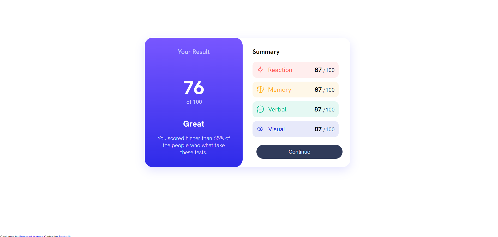
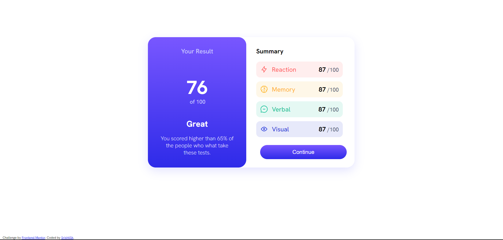
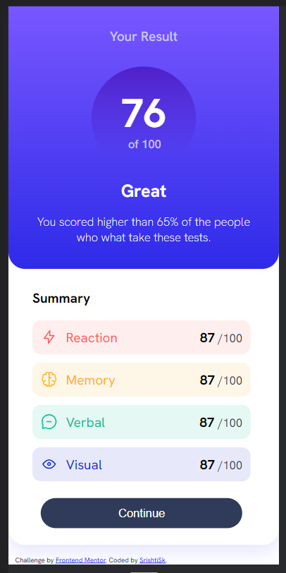
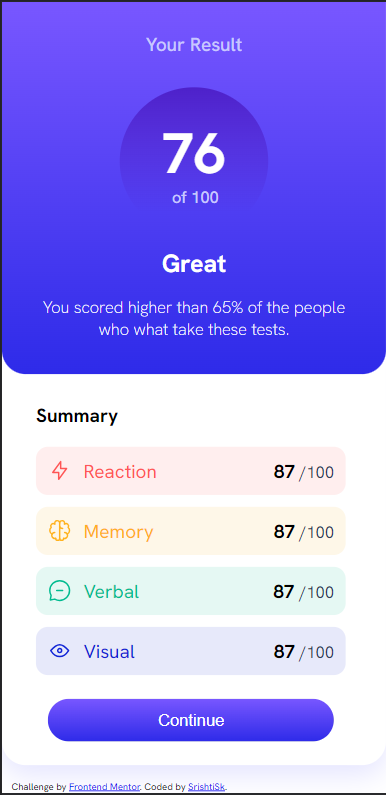

# Frontend Mentor - Results summary component solution

This is a solution to the [Results summary component challenge on Frontend Mentor](https://www.frontendmentor.io/challenges/results-summary-component-CE_K6s0maV). Frontend Mentor challenges help you improve your coding skills by building realistic projects. 

## Table of contents

- [Overview](#overview)
  - [Screenshot](#screenshot)
  - [Links](#links)
- [Author](#author)
- [Acknowledgments](#acknowledgments)

## Overview

### Screenshot

|  |  |
| --------------------------------------- | --------------------------------------- |
|  |  |

### Links

- Solution URL: [solution URL here](https://github.com/SrishtiSk/results-summary-componen)
- Live Site URL: [Live site URL here](https://srishtisk.github.io/results-summary-component)

### Built with

- Semantic HTML5 markup
- CSS custom properties
- Flexbox
- CSS Grid
- JQuery

## Author

- Frontend Mentor - [@SrishtiSk](https://www.frontendmentor.io/profile/SrishtiSk)
